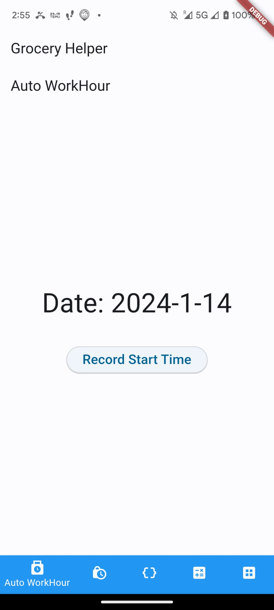
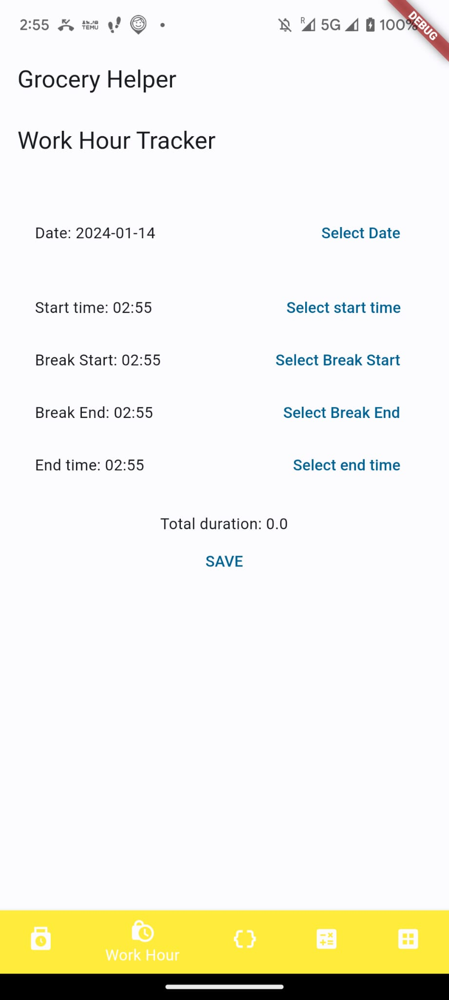
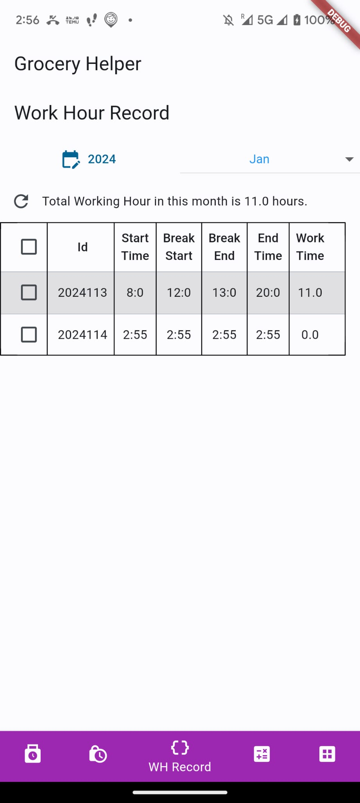
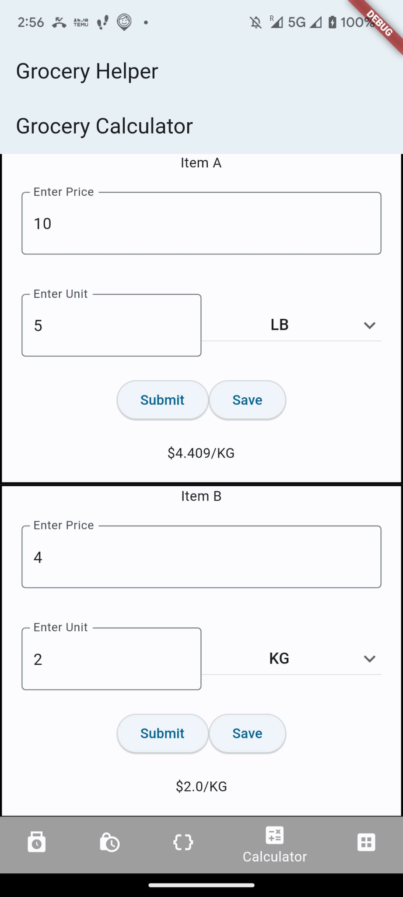
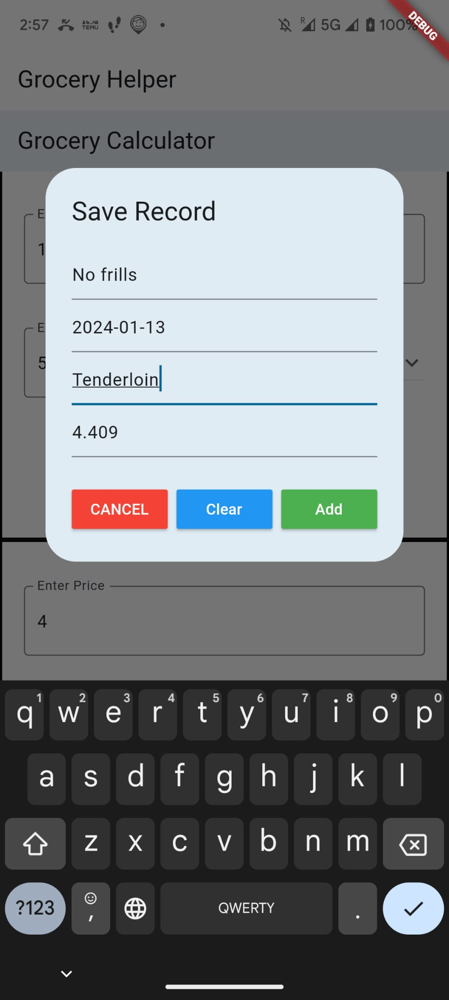
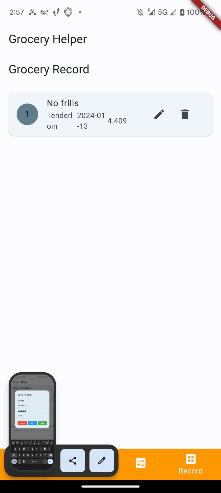
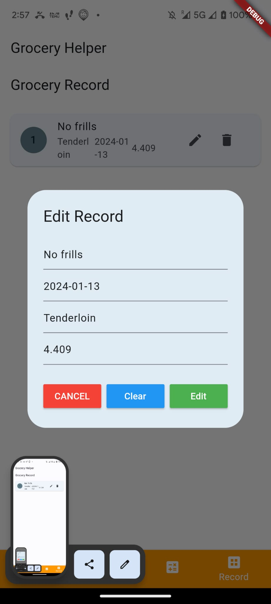

# Daily Helper

Daily Helper is a versatile Flutter application designed to assist users in managing their daily activities and making price comparisons between different units which built on flutter framework.

## Features

### 1. Daily Working Hours Tracker

- Record and manage daily working hours.
- Track break start and end times.
- User-friendly CRUD functionality through the UI.
<p>
        
        
        
</p>

### 2. Unit Price Comparison

- Convert different units to facilitate price comparison.
- Example: Compare $5/10lb with $4/2kg.

<p>
        
</p>

### 3. Grocery Purchase List

- Record and manage items that users want to save.
- View, add, edit, and delete items in a list.

<p>
        
        
        
</p>

## Getting Started

To get started with Daily Helper, follow these steps:

```bash
   git clone https://github.com/your-username/Daily-Helper.git
   flutter pub get
   flutter run
```
